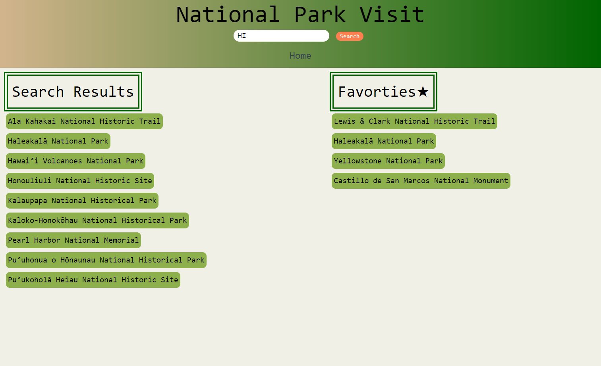

Live Link https://ckietzm2.github.io/National-Park/

# National Park Info Webpage

## Description

Welcome to the National Park Info Webpage for the United States! This is a interactive webpage that allows you to explore national parks in different states across the country. Simply enter the initials of the state you're interested in, then click on the park you want and discover some information about that park located there! You will be presented with the park hours, general info, their website, and even the weather forecast for the next 5 days!

You will also have the option to add parks to a fivorites list to easily re-vist the info you want the most. 

## Installation

N/A

## Usage

Link to Github https://github.com/ckietzm2/National-Park

Link to webpage: https://ckietzm2.github.io/National-Park/

## Credits

Classmates on the Project:

Cody Kietzman
Taylor Cannon
Travis Routhier
Eric Olson

Google
TailwindCSS

## License

This project is licensed under the MIT License - see the LICENSE file for details.

